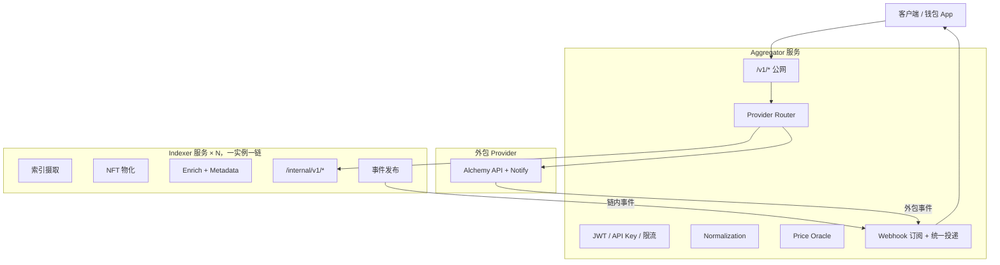
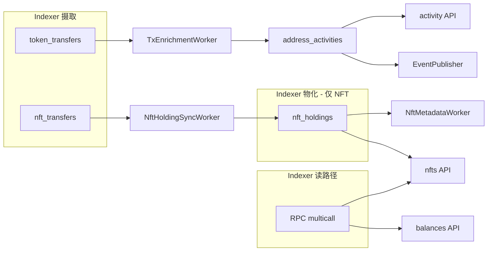
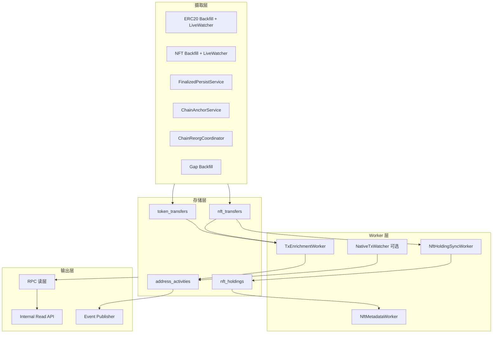
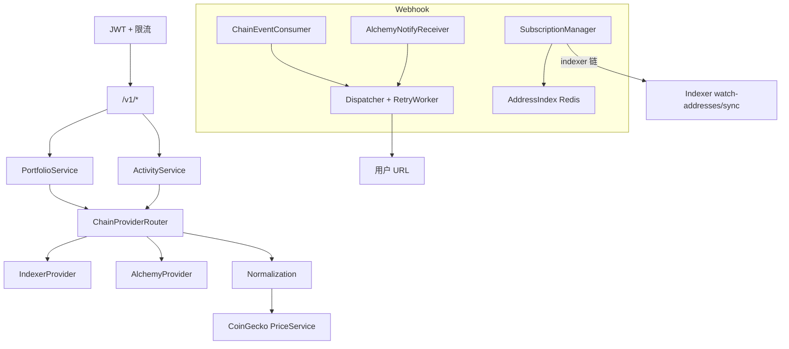
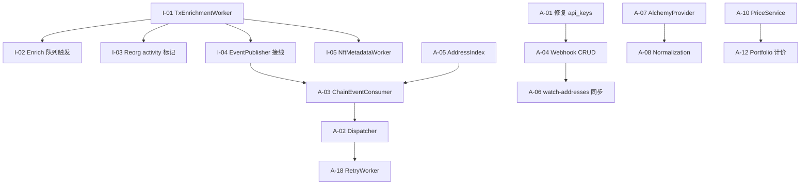

# Indexer 服务 & Aggregator 服务 — 详细设计方案（v3）

> **文档用途**：Agent / 开发者实施参照。基于 `wallet-data-service` 拆分；**原型无分区/热温归档**；**无 Top Holders / 无 ERC20 物化**。
>
> **仓库结构**（当前）：
>
> ```
> wallet-platform/
> ├── indexer/                 # wallet-indexer：一实例一链
> ├── aggregator/              # wallet-aggregator：对外网关
> ├── shared/canonical/        # Canonical Model v1 共享类型
> └── docs/DESIGN-v3.md        # 本文档
> ```

---

## 目录

1. [总体架构](#1-总体架构)
2. [服务边界](#2-服务边界)
3. [Indexer 服务](#3-indexer-服务)
4. [Aggregator 服务](#4-aggregator-服务)
5. [Canonical Model v1](#5-canonical-model-v1)
6. [服务交互时序](#6-服务交互时序)
7. [错误与降级](#7-错误与降级)
8. [部署](#8-部署)
9. [代码映射（现有实现）](#9-代码映射现有实现)
10. [实施检查清单与未完成项](#10-实施检查清单与未完成项)

---

## 1. 总体架构



### 1.1 核心原则

| 原则 | 说明 |
|------|------|
| 一实例一链 | 每个 Indexer 绑定一个 `CHAIN_ID` + RPC；多链 = 多 Indexer 实例 |
| 用户只访问 Aggregator | 鉴权、跨链、价格、Webhook 全在 Aggregator |
| Provider 可插拔 | 每条链配置 `indexer` 或 `alchemy` |
| Canonical Model v1 | 两服务唯一数据契约，定义于 `shared/canonical/` |
| 原型存储 | 普通 PostgreSQL 表，无分区、无 `archive` schema |
| 钱包导向 | 不做 Top Holders；ERC20 余额纯 RPC multicall，不建物化快照 |

### 1.2 数据归属

| 数据 | 存放服务 / DB |
|------|---------------|
| `token_transfers` / `nft_transfers` | Indexer DB |
| `nft_holdings` / `nft_sync_state` | Indexer DB |
| `address_activities` / `known_contracts` / `method_signatures` / `watch_addresses` | Indexer DB |
| 索引元数据（checkpoints、anchors、contracts、chain_state） | Indexer DB |
| `api_keys` / `webhook_*` / `token_price_sources` / `chain_provider_config` | Aggregator DB |

---

## 2. 服务边界

### 2.1 职责矩阵

| 能力 | Indexer | Aggregator |
|------|:-------:|:----------:|
| ERC20/NFT 事件索引 | ✅ | ❌ |
| Reorg 检测与修复 | ✅ | ❌ |
| **NFT 物化**（`nft_holdings`） | ✅ | ❌ |
| ~~ERC20 物化~~（`token_balances`） | ❌ 删除 | ❌ |
| ~~Top Holders~~ | ❌ 删除 | ❌ 删除 |
| Tx Enrich + Activity 分类 | ✅ | ❌ |
| NFT Metadata 拉取 | ✅ | ❌ |
| 监控合约管理 | ✅ | ❌ |
| ERC20/Native 余额 RPC 读 | ✅ | ❌ |
| NFT 列表（DB 候选 + RPC 校验） | ✅ | ❌ |
| 跨链 Portfolio / Activity | ❌ | ✅ |
| 法币价格（CoinGecko） | ❌ | ✅ |
| 用户 JWT / API Key | ❌ | ✅ |
| Provider 路由与 Adapter | ❌ | ✅ |
| Webhook 订阅 CRUD | ❌ | ✅ |
| Webhook 签名投递 / 重试 | ❌ | ✅ |
| 链内事件产生 | ✅ | ❌ |
| 外包事件接收 | ❌ | ✅ |
| 对外 `/v1/*` | ❌ | ✅ |
| 对内 `/internal/v1/*` | ✅ | ✅（接收 Indexer/Alchemy 事件） |
| Prometheus / Health | 各自独立 | 各自独立 |

### 2.2 资产读路径（关键决策）

| 资产类型 | 余额来源 | 历史/活动来源 |
|----------|----------|---------------|
| Native | RPC `getBalance` @ `finalized` | enrich / `NativeTxWatcher` 补洞 |
| ERC20 | RPC `balanceOf` multicall @ `finalized` | `token_transfers` → enrich → `address_activities` |
| NFT | `nft_holdings` 候选 + RPC `ownerOf`/`balanceOf` 校验 | `nft_transfers` → enrich → `address_activities` |

**ERC20 不建物化快照**：`balanceOf` 一次 multicall 即可；钱包场景不需要 holder 排名。

### 2.3 数据流（Indexer 内部）



### 2.4 Webhook 边界

```
Indexer：finalized → enrich → 写入 address_activities → 发布 CanonicalChainEvent → Aggregator
Aggregator：订阅管理、地址匹配、统一 payload、HMAC 签名、重试投递
外包链：Alchemy Notify → Aggregator /internal/v1/events/alchemy-notify → 同一 Dispatcher
```

**Indexer 不直接推用户 URL。**

---

## 3. Indexer 服务

### 3.1 定位

**单链数据引擎**：链上摄取 → 存储 → NFT 物化 → 语义增强 → Metadata → 对内供数 → 向上游报事件。

### 3.2 进程架构



**Worker 清单（3 + 1 可选）**：

| Worker | 职责 | 目标文件 |
|--------|------|----------|
| `NftHoldingSyncWorker` | `nft_transfers` → `nft_holdings` | `indexer/src/materialization/nft-holding-sync-worker.ts` |
| `TxEnrichmentWorker` | tx 拉取、分类 → `address_activities` | `indexer/src/enrich/`（`tx-enrichment-worker.ts` 等） |
| `NftMetadataWorker` | `tokenURI` → name/image | `indexer/src/metadata/nft-metadata-worker.ts` |
| `NativeTxWatcher`（可选） | `watch_addresses` 补 native transfer | **待新建** |

~~`BalanceSyncWorker`~~ 已删除，不得恢复。

### 3.3 启动与关闭顺序

**启动**（`indexer/src/main.ts`）：

1. 环境变量校验（`loadEnv`）
2. 创建 DB 连接池（api / worker 分离）、Redis、RPC 客户端
3. 校验 `CHAIN_ID` 与 RPC `chainId` 一致
4. `IndexerApp.run()` — 索引摄取（ERC20 + NFT backfill + live）
5. `NftHoldingSyncWorker.start()`
6. `TxEnrichmentWorker.start()`
7. `NftMetadataWorker.start()`
8. Internal API HTTP 监听

**关闭**（逆序）：

1. HTTP server `close()`
2. Workers `stop()`
3. `IndexerApp.shutdown()`（停止 live watcher、reorg/gap 定时器）
4. 关闭 DB 连接池、Redis

### 3.4 功能模块详述

#### A. 索引摄取

| 模块 | 输出 | 现有代码 |
|------|------|----------|
| ERC20 回填 + 实时 WS | `token_transfers` | `indexer/src/ingest/erc20/` |
| NFT 回填 + 实时 WS | `nft_transfers` | `indexer/src/ingest/nft/` |
| Finalized 批量写入 | 两表 + checkpoint 推进 | `indexer/src/ingest/service/finalized-persist-service.ts` |
| 块锚点 + Gap backfill | `indexer_block_anchors` | `chain-anchor-service.ts`、`indexer-app.ts` gap tick |
| Reorg | `status = reorged`，触发 NFT rewinder | `chain-reorg-coordinator.ts`、`reorg-service.ts` |

**约束**：

- 无 `PartitionService`；直接写普通表
- `INDEXER_START_LOOKBACK_BLOCKS` 限制历史扫描窗口
- 监控合约来自 `monitored_contracts` 表（`is_active = true`）

#### B. NFT 物化层（唯一保留的物化）

| 步骤 | 说明 |
|------|------|
| 增量扫描 | `NftHoldingSyncWorker` 按 `nft_sync_state.last_synced_block` 与 finalized 块高差值拉取 `nft_transfers` |
| 持有更新 | 对每条 transfer：from `-amount`、to `+amount`；`amount <= 0` 的行保留或删除（当前实现保留 `amount=0` 过滤在查询层） |
| 水位线 | 每合约推进 `nft_sync_state.last_synced_block` |
| Reorg | `NftHoldingRewinder`：删除 reorg 块高以上影响的 token_id 持有，从 `status='indexed'` 的 transfer 重算 |

#### C. Enrich 层（TxEnrichmentWorker）

**触发**：`token_transfers` / `nft_transfers` finalized 写入后，将 `tx_hash` 推入 Redis 集合/队列去重。

Redis key 约定：`tx:enrich:{chainId}`（Set 或 Stream，推荐 Set + SPOP 批处理）。

**处理流程**（每个 `tx_hash`）：

```
1. SPOP / 批量取出待 enrich 的 tx_hash
2. RPC getTransaction + getTransactionReceipt（blockTag: finalized 或 tx 所在块）
3. 若 receipt.status = 0 → tx_status = failed，否则 success
4. 收集同 tx 的 token_transfers + nft_transfers（status=indexed）
5. 解码 input：
   - 查 known_contracts + method_signatures
   - 匹配 method_selector → method_name
   - 未知 → activity_type = contract_call，method_name = null
6. 分类规则（优先级从高到低）：
   - 合约创建（tx.to = null）→ contract_creation
   - logs 含 DEX swap 特征（known_contracts.protocol + 事件模式）→ dex_swap
   - ERC20 Approval 事件 → erc20_approve
   - 有 nft_transfers → nft_transfer
   - 有 token_transfers → erc20_transfer
   - tx.value > 0 且无 token transfer → native_transfer
   - 其他 → contract_call
7. 构建 movements[]（地址视角，in/out）：
   - native: { assetType: native, amountRaw, amount, direction }
   - erc20: { assetType: erc20, contract, symbol, amountRaw, amount, direction }
   - nft: { assetType: erc721|erc1155, contract, tokenId, amount, direction }
8. 确定 participant 集合：
   - tx.from
   - tx.to（若非 null）
   - 所有 transfer 的 from_address / to_address
   - 去重、lower case
9. 对每个 participant UPSERT address_activities：
   PRIMARY KEY (chain_id, tx_hash, participant_address)
10. 对新写入且 status=indexed 的行 → EventPublisher.publish(activity_created)
```

**activity_type 枚举**：

`contract_creation` | `native_transfer` | `erc20_transfer` | `nft_transfer` | `erc20_approve` | `dex_swap` | `contract_call`

**Reorg 处理**：

- Reorg 修复事务内（或 repair 完成后异步）：将受影响 `tx_hash` 的 `address_activities.status` 置为 `reorged`
- 对每个被标记行发布 `CanonicalChainEvent { eventType: activity_reverted }`
- enrich 队列中对应 tx 若需重算，在 reorg 回填完成后重新入队

**与 FinalizedPersist 集成点**：

在 `FinalizedPersistService.persistBatch` 成功 commit 后，通过构造函数注入的 `onPersisted` 回调，对 batch 内 `filtered` 记录的 `tx_hash` 去重后调用 `EnrichQueue.enqueue(chainId, txHashes)`（`IndexerApp.createErc20PersistService` / `createNftPersistService` 接线）。

#### D. NFT Metadata 层（NftMetadataWorker）

**解耦原则**：不阻塞 `NftHoldingSyncWorker`。

```
循环（METADATA_INTERVAL_MS）：
  1. SELECT FROM nft_holdings
     WHERE chain_id=$1 AND metadata_fetch_status='pending' AND amount>0
     LIMIT 50
     FOR UPDATE SKIP LOCKED
  2. 批量 multicall tokenURI(contract, tokenId)
  3. 解析 URI：
     - ipfs:// → 网关 HTTP
     - ar:// → arweave 网关
     - data: → 内联 JSON
     - http(s):// → 直接 GET
  4. 解析 JSON：name, image / image_url
  5. UPDATE nft_holdings SET
       metadata_uri, name, image_url,
       metadata_fetch_status = ok|failed|unsupported,
       metadata_fetched_at = NOW()
  6. 失败指数退避重试（可选：连续失败 3 次标 failed）
```

**metadata_fetch_status**：`pending` | `fetching` | `ok` | `failed` | `unsupported`

#### E. RPC 读层

| 方法 | 用途 | 现有代码 |
|------|------|----------|
| ERC20 multicall `balanceOf` @ finalized | `/balances` tokens | `balance-query-service.ts` |
| `getBalance` @ finalized | `/balances` native | 同上 |
| NFT multicall `ownerOf` / `balanceOf` | `/nfts` 校验候选 | `nft-chain-verifier.ts` |

**NFT 列表策略**：

1. DB：`nft_holdings WHERE owner_address=$addr AND amount>0 ORDER BY updated_at DESC LIMIT/OFFSET`
2. RPC 校验：ERC721 `ownerOf`；ERC1155 `balanceOf(user, tokenId)`
3. 校验失败（非 owner / balance=0）的候选**不返回**（不写回 DB，避免读路径副作用）

#### F. 事件发布层（EventPublisher）

```
触发：address_activities 新写入（status=indexed）或 reorg 标记（status=reorged）
目标：POST {AGGREGATOR_EVENT_URL}  默认 /internal/v1/events/chain-activity
Header：X-Internal-Api-Key: {INTERNAL_API_KEY}
Body：CanonicalChainEvent
```

**eventId 生成**：`{chainId}:{txHash}:{participant}:{eventType}` 或 UUID v5 确定性 ID。

**失败策略**：日志 + 可选 Redis 死信队列重试（原型可仅 warn 日志）。

#### G. NativeTxWatcher（可选）

```
循环：
  1. SELECT address FROM watch_addresses WHERE chain_id=$1
  2. 对每个地址，扫描 finalized 块区间内 to=address 且 value>0 的交易
     （可用 eth_getLogs 不适用；需 block scan 或 txpool 索引 — 原型可用较窄窗口 + 增量 checkpoint）
  3. 对未见过的 tx_hash 直接 enrich（无 transfer 表记录）
```

原型可延后；无此 Worker 时 native 活动仅覆盖「有 ERC20/NFT transfer 的同 tx」或显式 enrich 触发。

#### H. 内部读 API

**鉴权**：`X-Internal-Api-Key`，仅内网；中间件 `internal-auth.ts`。

| 方法 | 路径 | 说明 |
|------|------|------|
| GET | `/internal/v1/health` | DB / Redis / RPC / 索引 lag |
| GET | `/internal/v1/chain/status` | finalized 块高、checkpoint、监控合约数 |
| GET | `/internal/v1/address/:addr/balances` | native + tokens + nfts（CanonicalBalances） |
| GET | `/internal/v1/address/:addr/nfts` | 分页 NFT + metadata |
| GET | `/internal/v1/address/:addr/activity` | 分类活动流（keyset 分页） |
| POST | `/internal/v1/watch-addresses/sync` | Aggregator 同步监控地址列表 |
| GET | `/metrics` | Prometheus 文本格式 |

**Query 参数（activity）**：

- `limit`：默认 20，最大 100
- `cursor`：base64url JSON `{ blockNumber, txHash }`
- `types`：逗号分隔 activity_type 过滤

**Query 参数（nfts）**：

- `limit`：默认 50，最大 200
- `cursor`：base64url JSON `{ updatedAt, contractAddress, tokenId }` 或使用 offset 原型

**不暴露**：JWT、公网 CORS、Top Holders、跨链接口。

### 3.5 数据库 Schema（Indexer）

Migration 目录：`indexer/migrations/`

#### 索引表

```sql
-- 002_token_transfers.sql
token_transfers (
  chain_id, contract_address, symbol, tx_hash, log_index,
  block_number, block_timestamp, from_address, to_address,
  amount_raw, amount, status, created_at,
  PRIMARY KEY (chain_id, tx_hash, log_index, block_number)
);

-- 003_nft_transfers.sql
nft_transfers (
  chain_id, contract_address, token_id, token_standard,
  tx_hash, log_index, batch_index, block_number, block_timestamp,
  from_address, to_address, amount, status, created_at,
  PRIMARY KEY (chain_id, tx_hash, log_index, batch_index, block_number)
);
```

#### 物化表（仅 NFT）

```sql
-- 007_nft_holdings.sql
nft_holdings (
  chain_id, contract_address, token_id, token_standard,
  owner_address, amount,
  metadata_uri, name, image_url,
  metadata_fetch_status,   -- pending|fetching|ok|failed|unsupported
  metadata_fetched_at,
  last_transfer_block, updated_at,
  PRIMARY KEY (chain_id, contract_address, token_id, owner_address)
);

-- 008_nft_sync_state.sql
nft_sync_state (
  chain_id, contract_address,
  last_synced_block, updated_at,
  PRIMARY KEY (chain_id, contract_address)
);
```

#### Enrich 表

```sql
-- 009_address_activities.sql
address_activities (
  chain_id, tx_hash, participant_address,
  block_number, block_timestamp,
  tx_from, tx_to, tx_value_raw, tx_status,
  activity_type, protocol,
  method_selector, method_name,
  movements JSONB NOT NULL DEFAULT '[]',
  status VARCHAR(16) DEFAULT 'indexed',  -- indexed | reorged
  enriched_at TIMESTAMPTZ,
  PRIMARY KEY (chain_id, tx_hash, participant_address)
);

-- 010_enrich_support.sql
known_contracts (chain_id, address, protocol, abi_key);
method_signatures (selector PK, method_name, abi_fragment JSONB);
watch_addresses (chain_id, address, synced_at);
```

#### 索引元数据

```sql
-- 001_monitored_contracts.sql
monitored_contracts (...);

-- 004_indexer_checkpoints.sql
indexer_checkpoints (...);

-- 005_indexer_chain_state.sql
indexer_chain_state (...);

-- 006_indexer_block_anchors.sql
indexer_block_anchors (...);
```

#### 明确不得引入

- `token_balances`
- `archive.*` / `archive_manifest`
- 分区子表 / `PartitionService`

### 3.6 环境变量（Indexer）

见 `indexer/.env.example`。关键项：

| 变量 | 说明 |
|------|------|
| `CHAIN_ID` | 本实例链 ID |
| `RPC_HTTP_URL` / `RPC_WS_URL` | 链 RPC |
| `DATABASE_URL` / `REDIS_URL` | 存储 |
| `INTERNAL_API_KEY` | 内部 API 鉴权 |
| `AGGREGATOR_EVENT_URL` | 事件推送目标（可选，未配置则跳过） |
| `CONFIRMATION_DEPTH` | 确认深度，默认 12 |
| `INDEXER_START_LOOKBACK_BLOCKS` | 历史扫描上限 |
| `NFT_SYNC_INTERVAL_MS` | NFT 物化轮询间隔 |
| `ENRICH_INTERVAL_MS` | Enrich worker 间隔 |
| `ENRICH_BATCH_SIZE` | 每 tick SPOP 批大小，默认 20 |
| `METADATA_INTERVAL_MS` | Metadata worker 间隔 |

---

## 4. Aggregator 服务

### 4.1 定位

**用户-facing 网关**：多链路由、格式统一、法币计价、鉴权、Webhook。

### 4.2 进程架构



### 4.3 Provider 路由

配置方式（原型）：环境变量 `CHAINS_JSON`。

```json
{
  "1": {
    "provider": "indexer",
    "endpoint": "http://eth-indexer:3001",
    "internalApiKey": "${ETH_INDEXER_KEY}"
  },
  "137": {
    "provider": "alchemy",
    "apiKey": "${ALCHEMY_KEY}",
    "network": "polygon-mainnet"
  }
}
```

**目标接口**（`aggregator/src/providers/chain-provider.ts`）：

```typescript
interface ChainProvider {
  readonly chainId: number;
  readonly type: 'indexer' | 'alchemy';

  getBalances(address: string): Promise<CanonicalBalances>;
  getNfts(address: string, opts: PageOpts): Promise<CanonicalNftPage>;
  getActivity(address: string, opts: ActivityQuery): Promise<CanonicalActivityPage>;
  health(): Promise<ProviderHealth>;
}
```

~~`getHolders()`~~ 删除。

### 4.4 对外 API

| 方法 | 路径 | Scope | 说明 |
|------|------|-------|------|
| GET | `/v1/health` | 无 | 含各链 provider health |
| POST | `/v1/auth/token` | 无 | API Key → JWT |
| POST | `/v1/auth/revoke` | JWT | 吊销 token |
| GET | `/v1/address/:addr/portfolio` | `read:balance` | 多链余额 + 计价 |
| GET | `/v1/address/:addr/balances` | `read:balance` | 多链余额（无计价或含计价） |
| GET | `/v1/address/:addr/nfts` | `read:balance` | 多链 NFT 分页 |
| GET | `/v1/address/:addr/activity` | `read:tx` | 多链活动流 |
| POST | `/v1/webhooks` | `manage:webhook` | 创建订阅 |
| GET | `/v1/webhooks` | `read:webhook` | 列表 |
| PATCH | `/v1/webhooks/:id` | `manage:webhook` | 更新 |
| DELETE | `/v1/webhooks/:id` | `manage:webhook` | 删除 |
| GET | `/v1/webhooks/:id/deliveries` | `read:webhook` | 投递记录 |
| POST | `/v1/webhooks/:id/test` | `manage:webhook` | 测试投递 |
| GET | `/metrics` | 内网 | Prometheus |

**对内 API**：

| 方法 | 路径 | 说明 |
|------|------|------|
| POST | `/internal/v1/events/chain-activity` | 接收 Indexer 事件 |
| POST | `/internal/v1/events/alchemy-notify` | 接收 Alchemy Notify |

### 4.5 核心服务逻辑

#### Portfolio

```
GET /v1/address/:addr/portfolio?chainIds=1,137
  1. fan-out 各链 provider.getBalances(address)
  2. 对每条链 tokens + native 调 PriceService → valueUsd
  3. 汇总 totalValueUsd
  4. 某链失败 → chains[].status=error, partial=true
```

#### Activity（跨链）

```
GET /v1/address/:addr/activity?chainIds=1,137&limit=20&cursor=...
  1. 解析 cursor 为 per-chain 或 global cursor（推荐 global）：
     GlobalCursor = { items: [{ chainId, blockNumber, txHash, timestamp }] }
  2. fan-out 各链 getActivity（每链 limit+1 条用于 merge）
  3. 按 timestamp DESC 归并排序（多路归并，非全量拉取）
  4. 取 top limit 条，生成 nextCursor
  5. partial=true 若任链失败
```

**原型简化**：若多链归并复杂，可先 `Promise.allSettled` + 内存 sort + slice，但 cursor 仅保证单链语义时需文档注明。

#### Normalization（Alchemy）

```
Alchemy getAssetTransfers / getAssetTransfers API
  → 按 txHash 分组
  → 映射 category 到 ActivityType
  → 构建 CanonicalActivityItem { provider: 'alchemy' }
```

外包链无 Swap 细分类时降级为 transfer 级 `erc20_transfer` / `native_transfer` / `nft_transfer`。

#### PriceService（CoinGecko）

```
token_price_sources (chain_id, contract_address, source, external_id)
  → CoinGecko simple/token_price 或 coins/{id}
  → Redis 缓存 PRICE_CACHE_TTL_SECONDS
  → 未知代币 valueUsd = null
```

#### Webhook 全链路

**订阅 CRUD**：

1. 校验 `target_url`（HTTPS）、`watch_addresses`（checksum 或 lowercase）
2. 写入 `webhook_subscriptions`
3. 更新 Redis `AddressIndex`：`addr:{chainId}:{address}` → Set<subscriptionId>
4. 对 `provider=indexer` 的 chainIds，合并地址列表 POST 到各 Indexer `/internal/v1/watch-addresses/sync`

**事件消费**：

```
ChainEventConsumer（Indexer 事件）:
  1. 解析 CanonicalChainEvent
  2. 对 activity.participant 及 movements 涉及地址查 AddressIndex
  3. 过滤 subscription（chain_ids、event_types、is_active）
  4. 入队 Dispatcher

AlchemyNotifyReceiver:
  1. 校验 Alchemy 签名
  2. Normalize → CanonicalChainEvent（eventType 映射）
  3. 同一 Dispatcher
```

**Dispatcher**：

```
对每个 (subscription, event):
  1. 构建 payload JSON（含 activity、eventType、emittedAt）
  2. HMAC-SHA256(secret, rawBody) → Header X-Webhook-Signature
  3. POST target_url，超时 10s
  4. 写入 webhook_deliveries
  5. 失败：指数退避 next_retry_at，最大 N 次后 status=dead
  6. 后台 RetryWorker 扫描 pending 且 next_retry_at <= NOW()
```

### 4.6 数据库 Schema（Aggregator）

```sql
-- 001_api_and_webhooks.sql（需扩展，见未完成项）
api_keys (
  id, key_hash, scopes, rate_limit,
  is_active, expires_at, last_used_at, created_at
);

webhook_subscriptions (
  id, api_key_id, target_url, secret,
  chain_ids INTEGER[], watch_addresses TEXT[], event_types TEXT[],
  is_active, created_at
);

webhook_deliveries (
  id, subscription_id, event_id, payload, status,
  attempt_count, next_retry_at, last_status_code, last_error,
  created_at, delivered_at,
  UNIQUE (subscription_id, event_id)
);

-- 待建 migration
token_price_sources (chain_id, contract_address, source, external_id);
chain_provider_config (chain_id, provider_type, config JSONB);  -- 可选，原型可用 CHAINS_JSON
```

**api_keys scopes 默认**：`read:balance`, `read:tx`；Webhook 需 `manage:webhook` / `read:webhook`。

### 4.7 环境变量（Aggregator）

见 `aggregator/.env.example`。

| 变量 | 说明 |
|------|------|
| `JWT_SECRET` | ≥32 字符 |
| `CHAINS_JSON` | 链 → provider 配置 |
| `COINGECKO_API_KEY` | 可选 |
| `INTERNAL_API_KEY` | 接收 Indexer/内部事件 |
| `CORS_ORIGINS` | 逗号分隔 |

---

## 5. Canonical Model v1

定义于 `shared/canonical/src/`，两服务通过 `@wallet-platform/canonical` 引用。

### 5.1 CanonicalBalances

```typescript
interface CanonicalBalances {
  chainId: number;
  address: string;
  native: { symbol: string; balanceRaw: string; balance: string };
  tokens: Array<{
    contractAddress: string;
    symbol: string;
    decimals: number;
    balanceRaw: string;
    balance: string;
  }>;
  nfts: Array<{
    contractAddress: string;
    tokenId: string;
    tokenStandard: 'ERC721' | 'ERC1155';
    amount: string;
    name: string | null;
    imageUrl: string | null;
    metadataUri: string | null;
  }>;
  finalizedBlock: string | null;
  indexedSinceBlock: string | null;
}
```

### 5.2 CanonicalNftPage

定义于 `shared/canonical/src/nfts.ts`。

```typescript
interface CanonicalNftPage {
  chainId: number;
  address: string;
  data: CanonicalBalances['nfts'];
  nextCursor: string | null;
  hasMore: boolean;
}
```

### 5.3 CanonicalActivityItem

```typescript
interface CanonicalActivityItem {
  id: string;                    // {chainId}:{txHash}:{participant}
  chainId: number;
  type: ActivityType;
  txHash: string;
  blockNumber: string;
  timestamp: string;             // ISO8601
  participant: string;
  from: string;
  to: string | null;
  protocol: string | null;
  method: { selector: string; name: string | null } | null;
  movements: Array<{
    assetType: 'native' | 'erc20' | 'erc721' | 'erc1155';
    contract: string | null;
    tokenId: string | null;
    symbol: string | null;
    amountRaw: string;
    amount: string;
    direction: 'in' | 'out';
  }>;
  status: 'success' | 'failed';
  provider: 'indexer' | 'alchemy';
}
```

### 5.4 CanonicalChainEvent

```typescript
interface CanonicalChainEvent {
  eventId: string;
  eventType: 'activity_created' | 'activity_reverted';
  chainId: number;
  activity: CanonicalActivityItem;
  emittedAt: string;             // ISO8601
}
```

### 5.5 PortfolioResponse

```typescript
interface PortfolioResponse {
  address: string;
  chains: Array<{
    chainId: number;
    status: 'ok' | 'error';
    error?: string;
    data?: CanonicalBalances & { chainTotalUsd?: string | null };
  }>;
  totalValueUsd: string | null;
  partial: boolean;
}
```

---

## 6. 服务交互时序

### 6.1 Portfolio

```
Client → Aggregator GET /v1/address/:addr/portfolio?chainIds=1,137
  ├─ chain 1  → IndexerProvider → GET /internal/v1/.../balances
  ├─ chain 137 → AlchemyProvider → Alchemy API
  ├─ PriceService → CoinGecko
  └─ 合并响应（partial 降级）
```

### 6.2 Activity + Webhook（自研链）

```
Indexer:
  transfer finalized
  → EnrichQueue
  → TxEnrichmentWorker → address_activities
  → EventPublisher → POST Aggregator /internal/v1/events/chain-activity

Aggregator:
  ChainEventConsumer → AddressIndex 匹配
  → Dispatcher → HMAC POST 用户 URL
  → webhook_deliveries 记录
```

### 6.3 Webhook（外包链）

```
Alchemy Notify → Aggregator POST /internal/v1/events/alchemy-notify
              → Normalize → 同一 Dispatcher
```

### 6.4 订阅创建时地址同步

```
Client POST /v1/webhooks { chainIds: [1], watchAddresses: [...] }
  → DB insert webhook_subscriptions
  → Redis AddressIndex 更新
  → IndexerProvider.syncWatchAddresses → POST /internal/v1/watch-addresses/sync
```

---

## 7. 错误与降级

| 场景 | 行为 |
|------|------|
| 某链 Indexer 不可用 | `partial: true`，该链 `status: error` |
| Alchemy 限流 | 重试 → 该链 error |
| Enrich 失败 | activity 暂缺；transfer 索引仍在；tx 保留在 enrich 队列 |
| 价格不可用 | `valueUsd: null`，`totalValueUsd` 为部分加总或 null |
| Webhook 投递失败 | 指数退避 → `dead` |
| 外包链无 Swap 分类 | `provider: alchemy`，transfer 级 type |
| EventPublisher 失败 | 日志 warn；不阻塞 enrich 写入 |

---

## 8. 部署

```yaml
aggregator:
  replicas: 2
  port: 3000
  exposure: public

indexer-ethereum:
  replicas: 1
  port: 3001
  exposure: internal
  env: CHAIN_ID=1

indexer-arbitrum:
  replicas: 1
  port: 3001
  exposure: internal
  env: CHAIN_ID=42161
```

- PostgreSQL：可共实例、分 database（`wallet_indexer` / `wallet_aggregator`）
- Redis：建议 key 前缀 `idx:` / `agg:` 隔离
- Docker：`indexer/Dockerfile`、`aggregator/Dockerfile`

---

## 9. 代码映射（现有实现）

| 设计模块 | 路径 | 状态 |
|----------|------|------|
| Indexer 入口 | `indexer/src/main.ts` | ✅ |
| 索引编排 | `indexer/src/ingest/indexer-app.ts` | ✅ |
| ERC20 索引 | `indexer/src/ingest/erc20/` | ✅ |
| NFT 索引 | `indexer/src/ingest/nft/` | ✅ |
| Finalized 持久化 | `indexer/src/ingest/service/finalized-persist-service.ts` | ✅ |
| Reorg | `indexer/src/ingest/service/chain-reorg-coordinator.ts` | ✅ |
| NFT 物化 | `indexer/src/materialization/` | ✅ |
| RPC 余额读 | `indexer/src/read-api/services/balance-query-service.ts` | ✅ |
| NFT 链上校验 | `indexer/src/chain-read/nft-chain-verifier.ts` | ✅ |
| Activity 查询 | `indexer/src/read-api/services/activity-query-service.ts` | ✅ |
| Internal API | `indexer/src/read-api/app.ts` | ✅ |
| Tx Enrich | `indexer/src/enrich/`（`tx-enrichment-worker.ts`、`enrich-queue.ts`、`tx-classifier.ts`、`activity-writer.ts`） | ✅ |
| NFT Metadata | `indexer/src/metadata/nft-metadata-worker.ts` | ✅ |
| EventPublisher | `indexer/src/events/event-publisher.ts` | ✅ |
| Canonical 类型 | `shared/canonical/src/` | ✅ |
| Aggregator 入口 | `aggregator/src/main.ts` | ✅ |
| JWT 鉴权 | `aggregator/src/api/middleware/auth.ts` | ✅ |
| Provider 路由 | `aggregator/src/providers/` | ✅ Indexer + Alchemy |
| Portfolio | `aggregator/src/services/portfolio-service.ts` | ✅ 含 CoinGecko 计价 |
| Activity | `aggregator/src/services/activity-service.ts` | ✅ 跨链 buffer cursor |
| PriceService | `aggregator/src/services/price-service.ts` | ✅ |
| Alchemy Normalization | `aggregator/src/providers/alchemy/normalize-activity.ts` | ✅ |
| Balances / NFTs API | `aggregator/src/api/routes/balances.ts`, `nfts.ts` | ✅ |
| 内部事件 | `aggregator/src/api/internal/events.ts` | ✅ ChainEventConsumer |
| Webhook AddressIndex | `aggregator/src/webhook/address-index.ts` | ✅ |
| Webhook SubscriptionManager | `aggregator/src/webhook/subscription-manager.ts` | ✅ |
| Webhook Dispatcher | `aggregator/src/webhook/dispatcher.ts` | ✅ |
| Webhook RetryWorker | `aggregator/src/webhook/retry-worker.ts` | ✅ |
| Webhook CRUD API | `aggregator/src/api/routes/webhooks.ts` | ✅ |
| Alchemy Notify | `aggregator/src/api/internal/alchemy-notify.ts` | ✅ |

---

## 10. 实施检查清单与未完成项

> **状态图例**：✅ 已完成 · ⚠️ 部分完成 · ❌ 未实现
>
> **最后对照代码库**：2026-06-30

### 10.1 Indexer 未完成项

| ID | 优先级 | 任务 | 目标路径 / 说明 | 状态 |
|----|--------|------|-----------------|------|
| I-01 | P0 | **TxEnrichmentWorker 完整实现** | `indexer/src/enrich/` 新建 `enrich-queue.ts`、`activity-writer.ts`、`tx-classifier.ts`、`transfer-loader.ts`、`activity-reorg-service.ts`；改造 `tx-enrichment-worker.ts` | ✅ |
| I-02 | P0 | Finalized 写入后入 Enrich 队列 | `finalized-persist-service.ts` 注入 `onPersisted` 回调；`IndexerApp` 接线 `EnrichQueue` | ✅ |
| I-03 | P0 | Reorg 时标记 `address_activities.status=reorged` | `activity-reorg-service.ts` + `reorg-service.ts` repair 事务内调用 | ✅ |
| I-04 | P0 | EventPublisher 接线 | `main.ts` 注入；enrich 写入 / reorg 后 `publish()` | ✅ |
| I-05 | P1 | **NftMetadataWorker 完整实现** | `indexer/src/metadata/nft-metadata-worker.ts` + `metadata-fetcher.ts` | ✅ |
| I-06 | P2 | NativeTxWatcher（可选） | `indexer/src/enrich/native-tx-watcher.ts` | ✅ |
| I-07 | P2 | `/internal/v1/nfts` 分页 query | `read-api/app.ts` + `balance-query-service.ts` | ✅ |
| I-08 | P2 | `/internal/v1/health` 增加 RPC + lag | `read-api/app.ts` | ✅ |
| I-09 | P2 | `GET /metrics` Prometheus | 新建 `read-api/routes/metrics.ts` | ✅ |
| I-10 | P3 | `known_contracts` / `method_signatures` 种子数据 | migration 或 seed 脚本 | ✅ |
| I-11 | P3 | 清理遗留 `holders` cache key | `infrastructure/cache/redis-client.ts` | ✅ |

### 10.2 Aggregator 未完成项

| ID | 优先级 | 任务 | 目标路径 / 说明 | 状态 |
|----|--------|------|-----------------|------|
| A-01 | P0 | **修复 api_keys migration** | `aggregator/migrations/002_api_keys_extend.sql` 增加 `is_active`, `expires_at`, `last_used_at` | ✅ |
| A-02 | P0 | **Webhook Dispatcher** | `aggregator/src/webhook/dispatcher.ts` | ✅ |
| A-03 | P0 | ChainEventConsumer 匹配订阅并投递 | `webhook/chain-event-consumer.ts` + `api/internal/events.ts` | ✅ |
| A-04 | P0 | Webhook 订阅 CRUD API | `api/routes/webhooks.ts` | ✅ |
| A-05 | P0 | AddressIndex（Redis） | `aggregator/src/webhook/address-index.ts` | ✅ |
| A-06 | P0 | 订阅变更同步 Indexer watch-addresses | `webhook/subscription-manager.ts` | ✅ |
| A-07 | P1 | **AlchemyProvider** | `providers/alchemy/alchemy-provider.ts` | ✅ |
| A-08 | P1 | Alchemy Normalization | `providers/alchemy/normalize-activity.ts` | ✅ |
| A-09 | P1 | Alchemy Notify 接收 | `api/internal/alchemy-notify.ts` | ✅ |
| A-10 | P1 | **CoinGecko PriceService** | `services/price-service.ts` | ✅ |
| A-11 | P1 | `token_price_sources` migration | `aggregator/migrations/003_token_prices.sql` | ✅ |
| A-12 | P1 | Portfolio `totalValueUsd` / `chainTotalUsd` | `portfolio-service.ts` | ✅ |
| A-13 | P2 | `GET /v1/address/:addr/balances` | `api/routes/balances.ts` | ✅ |
| A-14 | P2 | `GET /v1/address/:addr/nfts` | `api/routes/nfts.ts` | ✅ |
| A-15 | P2 | `ChainProvider.getNfts()` | `chain-provider.ts` + Indexer/Alchemy Provider | ✅ |
| A-16 | P2 | `CanonicalNftPage` 类型 | `shared/canonical/src/nfts.ts` | ✅ |
| A-17 | P2 | 跨链 Activity 正确多路归并 cursor | `activity-service.ts` + `activity-cursor.ts` | ✅ |
| A-18 | P2 | Webhook RetryWorker 后台任务 | `webhook/retry-worker.ts` | ✅ |
| A-19 | P2 | `GET /metrics` | `api/routes/metrics.ts` | ❌ |
| A-20 | P3 | `chain_provider_config` DB 表（可选） | migration + 配置加载 | ❌ |
| A-21 | P3 | Webhook delivery 查询 + test 端点 | `api/routes/webhooks.ts` | ✅ |

### 10.3 跨工程 / 质量

| ID | 优先级 | 任务 | 说明 | 状态 |
|----|--------|------|------|------|
| X-01 | P1 | 端到端集成测试 | enrich → event → webhook 投递 | ❌ |
| X-02 | P2 | 项目级 CI | `.github/workflows/` | ❌ |
| X-03 | P2 | 更新根 README 与本文档同步 | `README.md` | ⚠️ |

### 10.4 依赖关系（推荐实施顺序）



### 10.5 已完成项（无需重复实现）

- [x] 工程拆分：`indexer` / `aggregator` / `shared/canonical`
- [x] 删除：分区归档、`token_balances`、`BalanceSyncWorker`、Top Holders
- [x] ERC20 + NFT 索引（backfill + live + reorg + gap）
- [x] NFT 物化全链路（sync worker + rewinder + `nft_sync_state`）
- [x] RPC 余额读 + NFT DB+RPC 校验
- [x] Indexer Internal API 骨架（balances / nfts / activity / watch-addresses）
- [x] `address_activities` 等 enrich 表 migration
- [x] Tx Enrich 全链路（队列、分类、写入、EventPublisher、Reorg 标记）
- [x] Aggregator JWT + 限流 + IndexerProvider + AlchemyProvider
- [x] Portfolio / Activity 跨链 fan-out + CoinGecko 计价
- [x] PriceService + token_price_sources migration
- [x] Alchemy Normalization + getNfts / balances 公网 API
- [x] 跨链 Activity buffer cursor（`activity-cursor.ts`）
- [x] api_keys migration 扩展（`002_api_keys_extend.sql`）
- [x] Webhook / api_keys 表 migration（基础版）
- [x] Canonical Model v1 类型（除 CanonicalNftPage）
- [x] Dockerfile（两服务）

---

## 附录 A：Agent 实施约定

1. **先读本文档**再改代码；类型变更优先改 `shared/canonical`。
2. **不改设计边界**：不引入 ERC20 物化、Top Holders、分区表。
3. **Indexer 不暴露公网 API**；用户路径只走 Aggregator。
4. **Migration 顺序**：新 SQL 用递增编号，`pnpm migrate` 执行。
5. **占位文件**：`nft-metadata-worker.ts` 应替换为真实逻辑，勿另起平行实现（`tx-enrichment-worker.ts` 已实现）。
6. **完成后**：更新本文档 §10 对应项状态，并在 PR 描述中引用任务 ID（如 `I-01`）。

### 10.6 Aggregator 实现说明（2026-06-30 迭代）

**已实现（本轮）**：A-02～A-06、A-09、A-18、A-21 — Webhook 全链路（订阅 CRUD、AddressIndex、Indexer watch-addresses 同步、ChainEventConsumer、HMAC 投递、重试、Alchemy Notify）。

**刻意延后**：A-19（`/metrics`）、A-20（`chain_provider_config` DB）、X-01（端到端集成测试）。

**与设计差异 / 原型限制（需后续讨论）**：

| 项 | 说明 |
|----|------|
| Webhook 签名头 | 设计 §4.5 为 `X-Webhook-Signature`；实现为 HMAC-SHA256 hex 摘要（无 `sha256=` 前缀） |
| Alchemy Notify 验签 | 生产需配置 `ALCHEMY_WEBHOOK_SIGNING_KEY`；开发环境未配置时跳过验签 |
| Alchemy Notify 归一化 | `normalize-notify.ts` 按 from/to 各生成一条 `activity_created` 事件（与 Indexer participant 模型对齐） |
| 计价字段 | 设计 §5.5 未单独定义 `valueUsd`；已在 `shared/canonical/src/portfolio.ts` 增加 `PricedNativeBalance` / `PricedTokenBalance` |
| 跨链 Activity cursor | 采用 **per-chain provider cursor + buffer 余量**（`GlobalActivityCursor`），而非设计示例的 `items[]` 水印；语义等价但 JSON 结构不同 |
| Alchemy Activity 分页 | 入/出方向各调一次 `getAssetTransfers`，`pageKey` 不互通；多链混用 Indexer `{blockNumber,txHash}` 与 Alchemy `pageKey` cursor |
| Alchemy Activity 分类 | 无 enrich 层，降级为 transfer 级 `native_transfer` / `erc20_transfer` / `nft_transfer`（与设计 §7 一致） |
| 跨链 NFT 分页 | `/v1/.../nfts` 对多链共用单一 `cursor` query，未做 per-chain NFT cursor（设计未细化） |
| ERC20 价格 | 优先 `token_price_sources` 表；否则 CoinGecko `simple/token_price/{platform}`；未知代币 `valueUsd=null` |
| NFT 不计价 | Portfolio 仅对 native + ERC20 计价，`totalValueUsd` 不含 NFT 估值 |

---

## 附录 B：从 wallet-data-service 迁移对照

| 原路径 | 去向 |
|--------|------|
| `src/indexer/**` | `indexer/src/ingest/**` |
| `src/wallet/sync/nft-holding-sync-worker.ts` | `indexer/src/materialization/` |
| `src/wallet/sync/balance-sync-worker.ts` | **删除** |
| `src/wallet/service/holders-service.ts` | **删除** |
| `src/api/routes/holders.ts` | **删除** |
| `src/wallet/sync/materialization-rewinder.ts` | 仅 NFT → `nft-holding-rewinder.ts` |
| `src/wallet/service/balance-service.ts` | `balance-query-service.ts` |
| `src/wallet/service/tx-history-service.ts` | `activity-query-service.ts` + enrich |
| `src/api/**` | `aggregator/src/api/**`（重写） |

---

*文档版本：v3.0 · 维护者：wallet-platform 团队*
